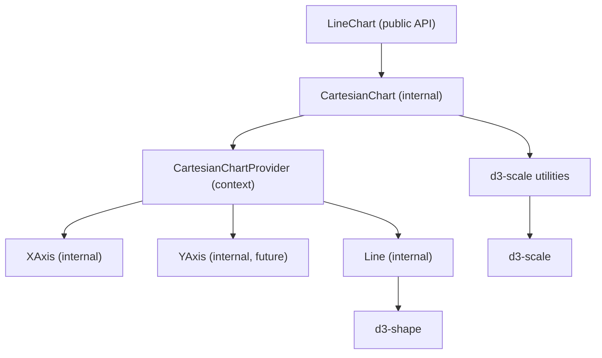
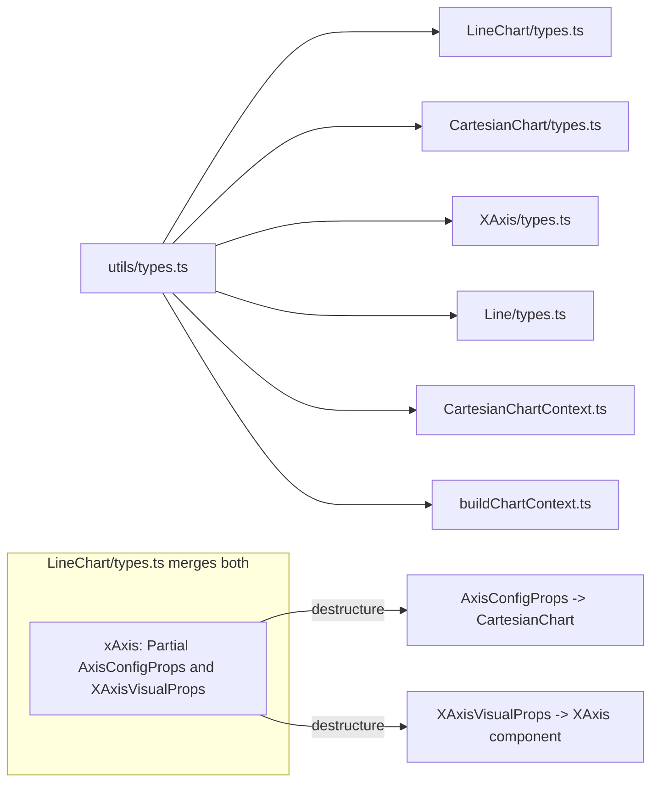

# Bootstrap Chart Infrastructure + XAxis

## Public API

**Only `LineChart` is exported** from the package. Sub-components (`CartesianChart`, `Line`, `XAxis`) are internal implementation details -- well-abstracted with clean boundaries so they can be promoted to public exports later when needed (e.g. for `CartesianChart` compositional usage), but not exposed in V1.

## Architecture Overview

Mirror the Coinbase CDS pattern: `CartesianChart` owns series data, computes D3 scales, and exposes them via React context. Internal child components (`XAxis`, `YAxis`, `Line`) consume that context. `LineChart` is the only public-facing component and orchestrates everything.




**Data flow:** `series[]` + `xAxis/yAxis` config props --> domain computation --> `d3-scale` scale objects --> stored in context as `getXScale()`/`getYScale()` --> consumed by `XAxis`/`Line` children.

---

## D3 Dependencies

Install as **runtime dependencies** in `libs/ui-react-visualization/package.json`:

- `**d3-scale`** + `**@types/d3-scale`** -- scale factories (`scaleLinear`, `scaleBand`, `scaleLog`)
- `**d3-shape`** + `**@types/d3-shape**` -- line/area path generators (for Line component + future BarChart)
- `**d3-array**` + `**@types/d3-array**` -- `extent`, `min`, `max` for domain computation

These are the minimal set for LineChart + BarChart. No need for `d3-interpolate-path` or `framer-motion` yet.

---

## File Structure

All under `libs/ui-react-visualization/src/lib/`:

```
lib/
├── Components/
│   ├── index.ts                          # re-exports ONLY LineChart (public API)
│   ├── CartesianChart/                   # INTERNAL - not exported from package
│   │   ├── index.ts
│   │   ├── types.ts                     # CartesianChartProps
│   │   ├── CartesianChart.tsx            # SVG container, ResizeObserver, calls buildChartContext, provider
│   │   ├── CartesianChartContext.ts       # context type + createContext + useCartesianChartContext hook
│   │   └── CartesianChart.test.tsx
│   ├── LineChart/
│   │   ├── index.ts                     # re-exports LineChart + LineChartProps
│   │   ├── types.ts                     # LineChartProps (imports from utils/types.ts + XAxis/types.ts)
│   │   ├── LineChart.tsx
│   │   ├── LineChart.stories.tsx
│   │   └── LineChart.test.tsx
│   ├── Line/                             # INTERNAL - not exported from package
│   │   ├── index.ts
│   │   ├── types.ts                     # LineProps
│   │   └── Line.tsx
│   └── XAxis/                            # INTERNAL - not exported from package
│       ├── index.ts
│       ├── types.ts                     # XAxisProps (imports XAxisVisualProps from utils/types.ts)
│       ├── XAxis.tsx
│       └── XAxis.test.tsx
└── utils/
    ├── index.ts
    ├── types.ts                          # shared domain types: Series, AxisConfigProps, AxisBounds,
    │                                     #   ChartInset, XAxisVisualProps, YAxisVisualProps,
    │                                     #   ChartScaleFunction, CartesianChartContextValue
    ├── scales.ts                         # D3 scale factories (getNumericScale, getCategoricalScale)
    ├── domain.ts                         # domain/range computation from series + config
    ├── buildChartContext.ts              # pure transform: (series, axisConfigs, drawingArea) -> context value
    ├── buildChartContext.test.ts         # unit tests for the pure transform
    └── math/
        └── index.ts                      # (keep existing, will populate with helpers)
```

---

## Types Convention

Following the `ui-react` established pattern: **component props are colocated** in each component's `types.ts`, while **shared domain types** stay in `utils/types.ts`.

### Shared domain types (`[utils/types.ts](libs/ui-react-visualization/src/lib/utils/types.ts)`)

Replace the existing `DataPoint`/`Series`. These are the charting domain model -- not props, but data structures shared across all components, the context, and utilities.

```ts
// ── Domain data ──
type AxisBounds = { min: number; max: number };
type ChartInset = { top: number; right: number; bottom: number; left: number };

type Series = {
  id: string;
  data?: Array<number | null>;
  label?: string;
  stroke: string;
};

// ── Axis scale config (passed to CartesianChart, stored in context) ──
type AxisConfigProps = {
  scaleType?: 'linear' | 'log' | 'band';
  data?: string[] | number[];
  domain?: Partial<AxisBounds> | ((bounds: AxisBounds) => AxisBounds);
};

// ── Axis visual props (shared domain type used by XAxis/YAxis component props AND LineChart props) ──
type XAxisVisualProps = {
  position?: 'top' | 'bottom';
  showGrid?: boolean;
  showLine?: boolean;
  ticks?: number[];
  tickLabelFormatter?: (value: number | string) => string;
};

type YAxisVisualProps = {
  position?: 'left' | 'right';
  showGrid?: boolean;
  showLine?: boolean;
  ticks?: number[];
  tickLabelFormatter?: (value: number | string) => string;
};

// ── Scale types ──
type ChartScaleFunction = NumericScale | CategoricalScale;

// ── Context value ──
type CartesianChartContextValue = { ... };
```

### Colocated component props

Each component folder has its own `types.ts` that defines its props, importing shared types:

- **`LineChart/types.ts`** -- `LineChartProps` (imports `Series`, `AxisConfigProps`, `XAxisVisualProps`, `YAxisVisualProps`, `ChartInset`)
- **`CartesianChart/types.ts`** -- `CartesianChartProps` (imports `Series`, `AxisConfigProps`, `ChartInset`)
- **`XAxis/types.ts`** -- `XAxisProps` (imports `XAxisVisualProps`, re-exports or extends it)
- **`Line/types.ts`** -- `LineProps`

### Type flow diagram



The **same `XAxisVisualProps`** from `utils/types.ts` is used by:

1. `XAxis/types.ts` -- the internal `XAxis` component props
2. `LineChart/types.ts` -- the merged `xAxis` prop (intersected with `AxisConfigProps`)

---

## CartesianChartContext (`[CartesianChartContext.ts](libs/ui-react-visualization/src/lib/Components/CartesianChart/CartesianChartContext.ts)`)

Following CDS pattern -- a single context providing scales + series + drawing area. Uses types from `utils/types.ts`.

Simplified vs CDS: no `getSeries` helper (consumers use `series.find()` inline), no `chartWidth`/`chartHeight` (no child component needs the raw SVG dimensions -- `drawingArea` is sufficient), no multi-axis maps (single default axis), no `registerAxis`/`unregisterAxis` layout negotiation (axes use fixed `size` prop instead).

```ts
type CartesianChartContextValue = {
  series: Series[];
  xScale: ChartScaleFunction | undefined;
  yScale: ChartScaleFunction | undefined;
  xAxisConfig: AxisConfigProps | undefined;
  yAxisConfig: AxisConfigProps | undefined;
  drawingArea: { x: number; y: number; width: number; height: number };
  dataLength: number;
};
```

---

## `buildChartContext` (`[utils/buildChartContext.ts](libs/ui-react-visualization/src/lib/utils/buildChartContext.ts)`)

Pure function that orchestrates the transformation from props to context value. This is an improvement over the CDS approach (where the same logic is scattered across `useMemo` hooks inside the component). Being a pure function means it is **unit-testable without rendering**.

```ts
function buildChartContext(params: {
  series: Series[];
  xAxis?: Partial<AxisConfigProps>;
  yAxis?: Partial<AxisConfigProps>;
  drawingArea: { x: number; y: number; width: number; height: number };
}): CartesianChartContextValue;
```

Internally:
1. Compute X domain from series data + `xAxis.domain` overrides (via `computeDomain`)
2. Compute Y domain from series data + `yAxis.domain` overrides
3. Build X scale via `getNumericScale` / `getCategoricalScale`
4. Build Y scale (same, with range inversion for SVG coordinates)
5. Compute `dataLength` from axis data or longest series
6. Return the assembled `CartesianChartContextValue`

Tests can call `buildChartContext(...)` directly and assert scale domains, ranges, and data length without any React rendering.

---

## CartesianChart (`[CartesianChart.tsx](libs/ui-react-visualization/src/lib/Components/CartesianChart/CartesianChart.tsx)`)

- Accept `series: Series[]`, `xAxis: Partial<AxisConfigProps>`, `yAxis: Partial<AxisConfigProps>`, `width`, `height`, `inset`, `children`
- Note: receives **only** `AxisConfigProps` (scale config), not visual axis props
- Use a wrapper `<div>` + `ResizeObserver` to resolve `width` (when string/%) into pixels; `height` is always a number
- Compute `drawingArea` from resolved dimensions minus insets
- Call `buildChartContext({ series, xAxis, yAxis, drawingArea })` inside a `useMemo` to get the context value
- Wrap children in `CartesianChartProvider`
- Render `<svg>` with a `<g>` translated by inset

---

## XAxis (`[XAxis.tsx](libs/ui-react-visualization/src/lib/Components/XAxis/XAxis.tsx)`)

Props defined in `XAxis/types.ts`, importing `XAxisVisualProps` from `utils/types.ts`:

```ts
// XAxis/types.ts
import type { XAxisVisualProps } from '../../utils';

export type XAxisProps = XAxisVisualProps;
```

### Rendering logic

1. Read `xScale`, `xAxisConfig`, `drawingArea` from context
2. Compute tick positions:
  - If `ticks` provided, use those values mapped through `xScale`
  - Otherwise, for numeric scales use `scale.ticks()` (d3 auto), for band scales use all domain values
3. For each tick, render:
  - **Grid line** (if `showGrid`): vertical `<line>` from top to bottom of drawing area, stroke = `var(--border-muted-subtle)`
  - **Tick mark** (if `showLine`): small vertical `<line>` at axis edge, stroke = `var(--border-muted)`
  - **Tick label**: `<text>` formatted via `tickLabelFormatter`, fill = `var(--text-muted)`
4. **Axis baseline** (if `showLine`): horizontal `<line>` across full width, stroke = `var(--border-muted)`
5. Position the axis `<g>` at top or bottom of drawing area based on `position`

### Style tokens

- Grid lines: `var(--border-muted-subtle)`
- Tick marks + axis line: `var(--border-muted)`
- Tick labels: `var(--text-muted)`

Use `useTheme()` from `@libs/ui-react` if hex values are needed for SVG `stroke`/`fill` attributes. The theme JS objects map e.g. `theme['--border-muted']` to `'var(--color-border-muted)'`.

---

## Line (`[Line.tsx](libs/ui-react-visualization/src/lib/Components/Line/Line.tsx)`)

Minimal implementation:

- Accept `seriesId`, optional `stroke` override
- Read `xScale`, `yScale`, series data from context
- Use `d3-shape`'s `line()` generator with `curveBumpX` to produce a path string
- Render `<path>` with the computed `d`, `stroke`, `fill="none"`, `strokeWidth={2}`

---

## LineChart (`[LineChart.tsx](libs/ui-react-visualization/src/lib/Components/LineChart/LineChart.tsx)`)

### Props (in `LineChart/types.ts`)

```ts
// LineChart/types.ts
import type { Series, AxisConfigProps, XAxisVisualProps, YAxisVisualProps, ChartInset } from '../../utils';

export type LineChartProps = {
  series?: Series[];
  showXAxis?: boolean;
  showYAxis?: boolean;
  xAxis?: Partial<AxisConfigProps> & XAxisVisualProps;
  yAxis?: Partial<AxisConfigProps> & YAxisVisualProps;
  width?: number | string;  // default: '100%' (resolved via ResizeObserver)
  height?: number;           // default: 160
  inset?: number | Partial<ChartInset>;
  children?: ReactNode;
};
```

**Sizing behavior:**

- `width` defaults to `'100%'` -- the chart fills its parent. When a string/percentage is passed, `CartesianChart` wraps in a `<div>` and uses `ResizeObserver` to resolve the pixel value for D3 scales. When a `number` is passed, it's used directly.
- `height` defaults to `160` (pixels). Always a number -- avoids the common height-collapse issue with `100%` when the parent has no explicit height.

### Destructuring pattern (from CDS LineChart)

`LineChart` destructures the merged `xAxis` prop, routing each part to the right consumer:

```ts
const {
  scaleType, data, domain,   // --> AxisConfigProps --> CartesianChart
  ...xAxisVisualProps         // --> XAxisProps --> <XAxis> component
} = xAxis || {};
```

### Render

```tsx
<CartesianChart series={series} xAxis={xAxisConfig} yAxis={yAxisConfig} ...>
  {showXAxis && <XAxis {...xAxisVisualProps} />}
  {showYAxis && <YAxis {...yAxisVisualProps} />}
  {series?.map(s => <Line key={s.id} seriesId={s.id} />)}
  {children}
</CartesianChart>
```

---

## Barrel Exports

- `[Components/index.ts](libs/ui-react-visualization/src/lib/Components/index.ts)`: export **only `LineChart`** (public API). `CartesianChart`, `Line`, `XAxis` have their own `index.ts` for internal imports but are **not** re-exported from the package.
- `[utils/index.ts](libs/ui-react-visualization/src/lib/utils/index.ts)`: export types only (types are public). Scale/domain utils are internal.
- Root `[src/index.ts](libs/ui-react-visualization/src/index.ts)`: unchanged (already re-exports Components + utils)

