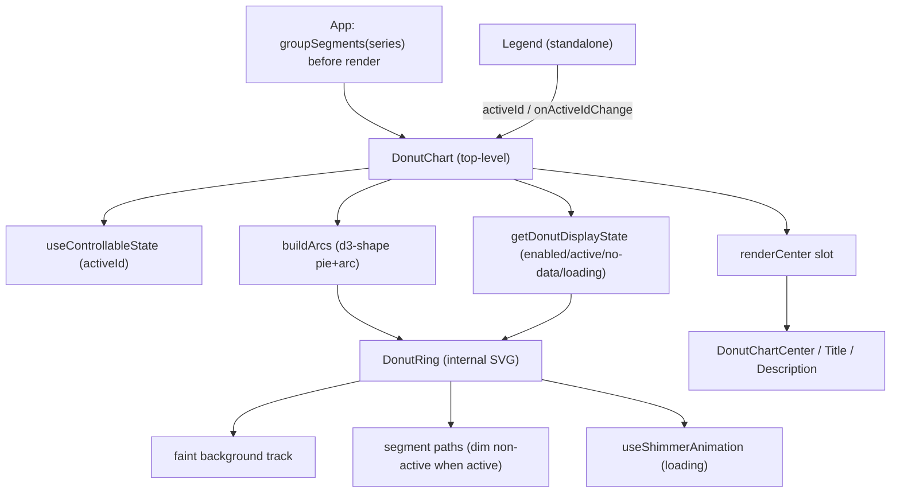

# DonutChart — Persistent Implementation Plan (source of truth)

DonutChart is an allocation / part-to-whole chart for Lumen. It renders a ring of segments with an optional interactive center, and pairs with a standalone `Legend` that is also reused by `LineChart`.

Target library: `libs/ui-react-visualization` (React/SVG, package `@ledgerhq/lumen-ui-react-visualization`). A React Native counterpart ships in `ui-rnative-visualization` mirroring this architecture.

## Architecture

- `DonutChart` is the only top-level chart component. It owns series data and active state.
- The ring (SVG arcs) is rendered internally — NOT exposed as a sub-component.
- The center is provided via the `renderCenter` prop (not a children function) and composed with flat sub-components.
- Active segment is data-driven through a single `activeId`, keyed by segment id. Segment hover and legend hover both flow through it.
- `Legend` is a standalone component, composable into both DonutChart and LineChart.




## 1. Figma source of truth

File `JxaLVMTWirCpU0rsbZ30k7` (2. Components Library). Three nodes define the component:

- `.ring-donut-chart` (node `17763:34874`) — internal ring primitive. Variants: `size` (md=168px, sm=80px) x `nbSegments` (1,2,3,4,5,6,7,7+). Renders N rounded arc segments with inter-segment gaps.
- `.ring-donut-chart` hovered matrix (node `17775:36056`) — the ring with one `activeSegment` highlighted and the rest dimmed, across all segment counts and crypto colors.
- `donut-chart` (node `17763:34880`) — the public component. Variants: `size` (md, sm) x `state` (`enabled`, `active`, `no-data`, `loading`).

Sizes match Figma 1:1: `sm`(80px) and `md`(168px). Default `md`. The Figma "7+" variant illustrates what a grouped result looks like — NOT a behavior the component performs (see Grouping below).


```ts
export type DonutSegment = {
  id: string;      // stable key, e.g. "bitcoin"
  label: string;   // "Bitcoin"
  value: number;   // raw; component computes percent
  color?: string;  // optional override; else default grey (--background-muted-strong). Palette + contrast is DLS-863.
};
```

## 3. Public API (`DonutChart/types.ts`)

Target (full) API:

```ts
export type DonutChartProps = {
  series: DonutSegment[];
  size?: 'sm' | 'md';            // default 'md' (sm=80px, md=168px)
  ariaLabel?: string;            // SVG role="img" label; default 'Donut chart'
  loading?: boolean;             // boolean, not a state variant
  activeId?: string | null;      // controlled; active is data-driven
  defaultActiveId?: string | null;
  onActiveIdChange?: (id: string | null) => void;
  renderCenter?: (params: {
    activeSegment: (DonutSegment & { percent: number }) | null;
    series: DonutSegment[];
  }) => ReactNode;
};
```

No `maxSegments` / grouping prop (grouping is external). No `emptyLabel` prop — the no-data state renders the faint empty track.

### Usage

```tsx
<DonutChart
  series={series}
  defaultActiveId={null}
  renderCenter={({ activeSegment, series }) =>
    activeSegment ? (
      <DonutChartCenter>
        <DonutChartTitle>{activeSegment.percent}%</DonutChartTitle>
        <DonutChartDescription>
          {activeSegment.label}
          <InteractiveIcon icon={ChevronRight} />
        </DonutChartDescription>
      </DonutChartCenter>
    ) : (
      <DonutChartCenter>
        <DonutChartTitle>{series.length}</DonutChartTitle>
      </DonutChartCenter>
    )
  }
/>

<Legend items={series} activeId={activeId} onActiveIdChange={setActiveId} position="bottom" />
```

## 4. Exports

- `DonutChart` — top-level
- `DonutChartCenter`, `DonutChartTitle`, `DonutChartDescription` — flat exports, no dot-namespacing
- `Legend` — standalone
- `groupSegments` — pure utility (grouping ticket)
- Not exposed: the ring (internal rendering only)

## 5. State model (mirror LineChart)

Follow the existing `getChartDisplayState` pattern in `[LineChart/utils.ts](libs/ui-react-visualization/src/lib/Components/LineChart/utils.ts)`. Add `getDonutDisplayState({ loading, hasData, activeId })`:

- `loading` -> shimmer ring via `useShimmerAnimation()` from `[CartesianChart/hooks/useShimmerAnimation.ts](libs/ui-react-visualization/src/lib/Components/CartesianChart/hooks/useShimmerAnimation.ts)`.
- `no-data` (empty series or total 0) -> faint full track only.
- `active` (`activeId != null`) -> active segment full color, others dimmed.
- `enabled` (default) -> all segments full color.

`ariaBusy={loading}` and an `ariaLabel` on the SVG, matching LineChart conventions. Accessibility (separate ticket) consumes the activeId contract.

## 6. Colors / tokens

Use `cssVar` from `@ledgerhq/lumen-design-core`.

- Default segment color: `--background-muted-strong` (#767676). Segments are neutral grey by default — the ring is NOT crypto-colored out of the box.
- `resolveSegmentColor(segment)` -> `segment.color ?? cssVar('var(--background-muted-strong)')`.
- Palette assignment + contrast adjustment vs the surface color is **DLS-863** (follow-up, shared with LineChart).
- Non-active dimming (active state): non-active segments render muted while the active segment keeps its resolved color — matched to node `17775:36056`.

## 7. Arc geometry (`DonutChart/utils.ts` + `utils.test.ts`)

Use `d3-shape` (already a dependency, used by Line):

- `getSegmentPercents(series)` — percent per segment from sum of `value` (guard total 0); also used to compute `activeSegment.percent` for `renderCenter`.
- `buildArcs(series, geometry)` — `pie<DonutSegment>().value(s => Math.max(s.value, 0)).sort(null).sortValues(null).padAngle(...)` for series-order angles, then `arc().innerRadius(r).outerRadius(r).cornerRadius(...)` for each `d` path. Rounded caps + gaps. Clockwise from 12 o'clock. Returns ordered `{ id, path, color, percent }`; returns `[]` for empty / all-zero series (drives the empty ring). Negative values are clamped to 0.
- `snapHalfCircle(datum)` — nudges a near-`π` slice to exactly `π` so two equal half-circle slices round their corners consistently (d3-shape squares corners a hair under `π`). Sub-pixel; never fires for real sub-half-circle slices.
- `buildEmptyRingPath(geometry)` — a full, gapless ring path used by `EmptyRing` for the no-data state.
- `DONUT_GEOMETRY` per size — sourced from `chartConfig.donut.size`. Shipped values: `md` { box 168, innerRadius 63, outerRadius 85, cornerRadius 4, padAngle 0.06 }, `sm` { box 80, innerRadius 31, outerRadius 42, cornerRadius 2, padAngle 0.08 }. Kept in one place for refinement.

## 8. Grouping / overflow — handled OUTSIDE the component

Grouping ("top N + other") is product policy and is handled in the domain apps, not the component. The design system ships a pure `groupSegments` helper that apps call before passing `series` in. `DonutChart` renders exactly the series it receives and never groups internally (no grouping prop). The Figma "7+" variant illustrates a grouped result, not component behavior.

- `groupSegments(series, options)` — pure, exported. Keeps the top N by value and aggregates the remainder into a single `{ id: 'other', label: 'Other', value: sum }` segment. Lives in the DonutChart utils and is re-exported from the package.

## 9. Components

- `DonutRing` (internal, not exported — like `Line`/`Axis`): renders `<svg>` with an origin-centered `viewBox` sized to the ring's outer diameter (so the ring is never clipped), one `<path>` per segment (series order), and a faint `EmptyRing` fallback for no-data. Iteration 1 ships the segments + empty ring; non-active dimming (`activeId`), shimmer (loading), and center content are pending (§5, §11). RN mirrors this with `react-native-svg` (`Svg`/`Path`) and resolves colors from `useTheme()` instead of `cssVar`.
- `DonutChartCenter` / `DonutChartTitle` / `DonutChartDescription`: flat presentational sub-components for the center slot (no dot-namespacing). Rendered via `renderCenter`, centered over the ring.
- `DonutChart` (top-level): resolves geometry from `size`, runs `getSegmentPercents` + `buildArcs`, wires `useControllableState` for `activeId`, derives state via `getDonutDisplayState`, and renders `DonutRing` + `renderCenter({ activeSegment, series })`. Stable `data-testid`s (`donut-chart`, `donut-segment`).

## 10. Legend (standalone, shared with LineChart)

`Legend` is its own component (ticket DLS-869), composable into both DonutChart and LineChart.

```ts
type LegendProps = {
  items: DonutSegment[];        // reuses the shared segment shape (id/label/color)
  activeId?: string | null;
  onActiveIdChange?: (id: string | null) => void;
  position?: 'top' | 'right' | 'bottom' | 'left';
};
```

Hovering a legend row and hovering a segment both flow through the same `activeId` / `onActiveIdChange`.

## 11. activeId contract (cross-cutting)

One id-keyed value, parent/provider-controlled, shared by segment interactivity (DLS-864) and Legend (DLS-869). `useControllableState` backs the uncontrolled case. Add a local copy under `libs/ui-react-visualization/src/lib/utils/useControllableState/` (`useControllableState.ts`, `.test.ts`, `index.ts`), seeded from `[libs/ui-react/src/utils/useControllableState/useControllableState.ts](libs/ui-react/src/utils/useControllableState/useControllableState.ts)`, exported from `utils/index.ts`, with a top-of-file TODO to consolidate into `@ledgerhq/lumen-utils-shared` later.

## 12. File structure

All under `libs/ui-react-visualization/src/lib/`. Only `DonutChart`, the flat center sub-components, `Legend`, and `groupSegments` are public; `DonutRing` stays internal (like `Line`/`Axis`).

```
lib/
├── config.ts                             # chartConfig.donut: defaultSegmentColor, emptyRingColor,
│                                         #   per-size geometry (box/innerRadius/outerRadius/cornerRadius/padAngle)
├── Components/
│   ├── index.ts                          # + export * from './DonutChart' and './Legend'
│   ├── DonutChart/
│   │   ├── index.ts                      # exports DonutChart, DonutChartCenter/Title/Description,
│   │   │                                 #   groupSegments, DonutChartProps
│   │   ├── DonutChart.tsx                # top-level component (owns series + activeId)
│   │   ├── DonutRing.tsx                 # INTERNAL SVG ring — NOT exported from package
│   │   ├── DonutChartCenter.tsx          # flat center sub-component
│   │   ├── DonutChartTitle.tsx           # flat center sub-component
│   │   ├── DonutChartDescription.tsx     # flat center sub-component
│   │   ├── types.ts                      # DonutChartProps (imports DonutSegment from utils)
│   │   ├── utils.ts                      # getSegmentPercents, buildArcs, DONUT_GEOMETRY (from config.ts),
│   │   │                                 #   resolveSegmentColor, getDonutDisplayState, groupSegments
│   │   ├── utils.test.ts
│   │   ├── DonutChart.test.tsx
│   │   └── __stories__/
│   │       ├── DonutChart.stories.tsx
│   │       └── DonutChart.mdx
│   └── Legend/                           # standalone, shared with LineChart
│       ├── index.ts                      # exports Legend + LegendProps
│       ├── Legend.tsx
│       ├── types.ts                      # LegendProps
│       ├── Legend.test.tsx
│       └── __stories__/
│           ├── Legend.stories.tsx
│           └── Legend.mdx
└── utils/
    ├── index.ts                          # + export DonutSegment and useControllableState
    ├── types.ts                          # + DonutSegment (shared with LineChart, DLS-863)
    └── useControllableState/
        ├── index.ts
        ├── useControllableState.ts       # local copy; TODO: consolidate into lumen-utils-shared
        └── useControllableState.test.ts
```

Stories follow the LineChart `__stories__` pattern (`StoryDecorator`, `tags: ['experimental']`, `title: 'Visualization/DonutChart'` and `'Visualization/Legend'`).

## 13. Stories & tests

- Stories: sizes (sm/md), N segments, a pre-grouped result (via `groupSegments`), active (controlled + uncontrolled), loading, no-data, `renderCenter` with center sub-components, and `Legend` wired to `activeId`.
- Tests: renders N arcs in series order; sm=80 / md=168 geometry; percent from sum; ring is internal; `activeId` controllable (controlled/uncontrolled + `onActiveIdChange` fires); loading and no-data states render; `groupSegments` collapses to top N + Other; Legend hover updates `activeId`.

## 14. Release plan

Add `.nx/version-plans/version-plan-<timestamp>-ui-react-visualization.md` with frontmatter `'@ledgerhq/lumen-ui-react-visualization': patch` and a `feat(DonutChart): ...` line (one package per file, always `patch`).

## Related tickets

- DLS-863 — shared color-contrast utility: palette assignment + contrast adjustment vs the surface, `applyContrastColors` opt-out, shared by DonutChart and LineChart (also covers the grouping helper's `Other` color). Flagged as an open design decision — see the ticket's Slack thread.
- DLS-864 — segment interactivity (activeId)
- DLS-869 — Legend
- Grouping ticket — `groupSegments` helper
- Accessibility ticket — consumes the activeId contract

## Open confirmations

- `groupSegments` signature/options (top-N count, ordering, Other label/color).
- Per-size geometry constants (strokeWidth, gap/padAngle, cornerRadius) measured from Figma.
- Legend item shape: reuse `DonutSegment` vs a lighter `{ id, label, color }` type.
