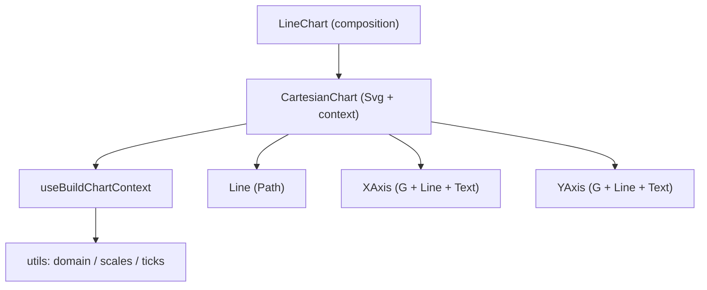

# React Native Visualization Library Alignment

## Current State

**Web library** ([libs/ui-react-visualization/](libs/ui-react-visualization/)) is fully implemented with:

- Cartesian chart container with context-based scale/layout system
- Line, XAxis, YAxis components rendering SVG primitives
- Pure utility modules: domain computation, d3-based scales, tick generation
- Shared type system (`Series`, `AxisConfigProps`, `DrawingArea`, etc.)

**RN library** ([libs/ui-rnative-visualization/](libs/ui-rnative-visualization/)) is a **placeholder**:

- `LineChart` renders a static purple rect with text "LineChart placeholder"
- `Series` type uses `{ timestamp, value }` data points (mismatched with web's `Array<number | null>`)
- `utils/math/index.ts` is an empty comment stub
- No context, no scales, no axes, no actual chart rendering

## Architecture

The web library's layering translates cleanly to RN:




The key adaptation: replace web `<svg>`, `<path>`, `<line>`, `<text>`, `<g>`, `<defs>`, `<linearGradient>`, `<stop>` with their `react-native-svg` equivalents (`Svg`, `Path`, `Line as SvgLine`, `Text as SvgText`, `G`, `Defs`, `LinearGradient`, `Stop`). Replace `ResizeObserver` with RN's `onLayout`.

## Key Decisions

- **Reuse pure utils verbatim**: `domain.ts`, `scales.ts`, `ticks.ts` are platform-agnostic (only d3 math). Copy them as-isinto the RN lib. This avoids extracting a shared package right now while keeping the door open for it later.
- **Align types with web**: Replace the current RN `Series` type (`DataPoint[]`) with the web's `Series` type (`data: Array<number | null>`, `stroke: string`). The existing RN `Series`/`DataPoint` types are unused in any production code.
- **Add `d3-array`, `d3-scale`, `d3-shape` as dependencies**: These are pure JS and work in RN without polyfills.
- **Add `@ledgerhq/lumen-utils-shared` as dependency**: Needed for `createSafeContext` (already RN-compatible, uses only React APIs).
- **Width measurement**: Replace `ResizeObserver` with RN `View.onLayout` in `CartesianChart`.
- **CSS variables for colors**: Replace `var(--border-muted)` etc. with theme-based colors via `useTheme()` from `@ledgerhq/lumen-design-core` or direct props.
- `**useId` replacement**: React Native supports `useId` from React 19. Since the project is on React 19, this works as-is.

## Implementation Steps

### 1. Add d3 dependencies to `package.json`

In [libs/ui-rnative-visualization/package.json](libs/ui-rnative-visualization/package.json), add:

- `dependencies`: `d3-array`, `d3-scale`, `d3-shape`, `@ledgerhq/lumen-utils-shared`
- `devDependencies`: `@types/d3-array`, `@types/d3-scale`, `@types/d3-shape`

### 2. Port utility modules (pure math, no platform code)

Copy from web and place into the RN lib:

- [utils/types.ts](libs/ui-react-visualization/src/lib/utils/types.ts) -- replaces the existing RN `types.ts` with the full web type system (`Series`, `AxisBounds`, `ChartInset`, `DrawingArea`, `AxisConfigProps`, scale types, `CartesianChartContextValue`, etc.)
- [utils/domain/domain.ts](libs/ui-react-visualization/src/lib/utils/domain/domain.ts) -- copy verbatim
- [utils/scales/scales.ts](libs/ui-react-visualization/src/lib/utils/scales/scales.ts) -- copy verbatim
- [utils/ticks/ticks.ts](libs/ui-react-visualization/src/lib/utils/ticks/ticks.ts) -- copy verbatim
- Update [utils/index.ts](libs/ui-rnative-visualization/src/lib/utils/index.ts) to re-export types matching the web barrel
- Remove the empty `utils/math/index.ts` stub

### 3. Port CartesianChart context (pure React, no platform code)

Copy from web into `Components/CartesianChart/context/`:

- `CartesianChartContext.ts` -- uses `createSafeContext` from `@ledgerhq/lumen-utils-shared` (RN-compatible)
- `useBuildChartContext.ts` -- copy verbatim (pure React hooks + d3 math)
- `context/index.ts` barrel

### 4. Implement CartesianChart component (RN adaptation)

Create [Components/CartesianChart/CartesianChart.tsx](libs/ui-rnative-visualization/src/lib/Components/CartesianChart/CartesianChart.tsx):

- Replace `<svg>` with `<Svg>` from `react-native-svg`
- Replace `<div ref={containerRef}>` + `ResizeObserver` with `<View onLayout={(e) => setMeasuredWidth(e.nativeEvent.layout.width)}>` 
- Replace `role="img"` + `aria-label` with `accessibilityRole="image"` + `accessibilityLabel`
- Copy `types.ts`, adapt: remove `string` width option (RN uses numeric or flex), keep `number | undefined` width with `onLayout` auto-measurement when omitted

### 5. Implement Line component (RN adaptation)

Create [Components/Line/Line.tsx](libs/ui-rnative-visualization/src/lib/Components/Line/Line.tsx):

- Replace `<path>` with `<Path>` from `react-native-svg`
- Replace `<defs>` / `<linearGradient>` / `<stop>` with `<Defs>` / `<LinearGradient>` / `<Stop>`
- `utils.ts` (path generation with d3-shape) copies verbatim -- it produces `d` attribute strings which work identically in `react-native-svg`
- Copy `types.ts` as-is

### 6. Implement XAxis component (RN adaptation)

Create [Components/XAxis/XAxis.tsx](libs/ui-rnative-visualization/src/lib/Components/XAxis/XAxis.tsx):

- Replace `<g>` with `<G>`, `<line>` with `<Line as SvgLine>`, `<text>` with `<Text as SvgText>`
- Replace `style={{ stroke: 'var(--border-muted)' }}` with `stroke={colors.border.muted}` from theme tokens or direct prop
- Replace `style={{ fill: 'var(--text-muted)' }}` with `fill={colors.text.muted}`
- Replace `dominantBaseline` (not supported by react-native-svg) with `dy` offsets
- Copy `types.ts` as-is

### 7. Implement YAxis component (RN adaptation)

Same pattern as XAxis -- adapt SVG element names and CSS variable references to RN-svg + theme tokens.

### 8. Replace LineChart placeholder

Rewrite [Components/LineChart/LineChart.tsx](libs/ui-rnative-visualization/src/lib/Components/LineChart/LineChart.tsx) following the web's composition pattern:

```tsx
<CartesianChart series={series} xAxis={xAxisConfig} yAxis={yAxisConfig} width={width} height={height} inset={inset}>
  {showXAxis && <XAxis ... />}
  {showYAxis && <YAxis ... />}
  {series?.map(s => <Line key={s.id} seriesId={s.id} showArea={showArea} />)}
  {children}
</CartesianChart>
```

Align `LineChartProps` with the web version (add `showArea`, `showXAxis`, `showYAxis`, `xAxis`, `yAxis`, `inset`).

### 9. Update barrel exports

- [Components/index.ts](libs/ui-rnative-visualization/src/lib/Components/index.ts) -- keep exporting `LineChart` (matching web's public surface)
- Add internal barrels for `CartesianChart`, `Line`, `XAxis`, `YAxis`

### 10. Update tests

- Rewrite [LineChart.test.tsx](libs/ui-rnative-visualization/src/lib/Components/LineChart/LineChart.test.tsx) to test real rendering (series produces paths, axes toggling, area fill) using `@testing-library/react-native`
- Port web's `useBuildChartContext.test.ts` verbatim (pure hook test, no DOM/RN dependency with `renderHook`)
- Port `domain.test.ts`, `scales.test.ts`, `ticks.test.ts` verbatim (pure math)

### 11. Update Storybook stories

Update [LineChart.stories.tsx](libs/ui-rnative-visualization/src/lib/Components/LineChart/LineChart.stories.tsx) to mirror the web's story variants (Basic, WithXAxis, MultipleSeries, WithArea, WithBothAxes, etc.) with the real component API.

## Files to Create/Modify Summary


| Action  | Path                                                                                                   |
| ------- | ------------------------------------------------------------------------------------------------------ |
| Modify  | `libs/ui-rnative-visualization/package.json` (add d3 + utils-shared deps)                              |
| Replace | `libs/ui-rnative-visualization/src/lib/utils/types.ts`                                                 |
| Create  | `libs/ui-rnative-visualization/src/lib/utils/domain/domain.ts`                                         |
| Create  | `libs/ui-rnative-visualization/src/lib/utils/domain/domain.test.ts`                                    |
| Create  | `libs/ui-rnative-visualization/src/lib/utils/scales/scales.ts`                                         |
| Create  | `libs/ui-rnative-visualization/src/lib/utils/scales/scales.test.ts`                                    |
| Create  | `libs/ui-rnative-visualization/src/lib/utils/ticks/ticks.ts`                                           |
| Create  | `libs/ui-rnative-visualization/src/lib/utils/ticks/ticks.test.ts`                                      |
| Modify  | `libs/ui-rnative-visualization/src/lib/utils/index.ts`                                                 |
| Delete  | `libs/ui-rnative-visualization/src/lib/utils/math/index.ts`                                            |
| Create  | `libs/ui-rnative-visualization/src/lib/Components/CartesianChart/CartesianChart.tsx`                   |
| Create  | `libs/ui-rnative-visualization/src/lib/Components/CartesianChart/types.ts`                             |
| Create  | `libs/ui-rnative-visualization/src/lib/Components/CartesianChart/index.ts`                             |
| Create  | `libs/ui-rnative-visualization/src/lib/Components/CartesianChart/context/CartesianChartContext.ts`     |
| Create  | `libs/ui-rnative-visualization/src/lib/Components/CartesianChart/context/useBuildChartContext.ts`      |
| Create  | `libs/ui-rnative-visualization/src/lib/Components/CartesianChart/context/useBuildChartContext.test.ts` |
| Create  | `libs/ui-rnative-visualization/src/lib/Components/CartesianChart/context/index.ts`                     |
| Create  | `libs/ui-rnative-visualization/src/lib/Components/Line/Line.tsx`                                       |
| Create  | `libs/ui-rnative-visualization/src/lib/Components/Line/types.ts`                                       |
| Create  | `libs/ui-rnative-visualization/src/lib/Components/Line/utils.ts`                                       |
| Create  | `libs/ui-rnative-visualization/src/lib/Components/Line/index.ts`                                       |
| Create  | `libs/ui-rnative-visualization/src/lib/Components/XAxis/XAxis.tsx`                                     |
| Create  | `libs/ui-rnative-visualization/src/lib/Components/XAxis/types.ts`                                      |
| Create  | `libs/ui-rnative-visualization/src/lib/Components/XAxis/index.ts`                                      |
| Create  | `libs/ui-rnative-visualization/src/lib/Components/YAxis/YAxis.tsx`                                     |
| Create  | `libs/ui-rnative-visualization/src/lib/Components/YAxis/types.ts`                                      |
| Create  | `libs/ui-rnative-visualization/src/lib/Components/YAxis/index.ts`                                      |
| Rewrite | `libs/ui-rnative-visualization/src/lib/Components/LineChart/LineChart.tsx`                             |
| Rewrite | `libs/ui-rnative-visualization/src/lib/Components/LineChart/LineChart.test.tsx`                        |
| Rewrite | `libs/ui-rnative-visualization/src/lib/Components/LineChart/LineChart.stories.tsx`                     |
| Modify  | `libs/ui-rnative-visualization/src/lib/Components/index.ts`                                            |


